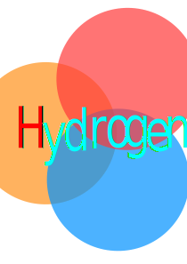

<div align="center">
    
</div>

<h1 align="center">HydrogenLib</h1>

<div align="center">

[](https://pypi.org/project/hydrogenlib)
[](https://pypi.org/project/hydrogenlib)
[](https://github.com/LittleSong2024/HydrogenLib)

</div>

当前为测试版本,功能可能有**缺失,不完整或错误**,详细请见[注意事项](#注意事项)
## 开发进度
<summary>
<details>

- [ ] boardcast_room
- [ ] codedoc
- [x] data_strctures
- [x] encrypt
- [ ] hycl(Hydrogen Config Language)
- [x] hyconfig(未严格测试)
- [ ] hydownloader
- [x] hystruct(长期更新)
- [x] json
- [ ] namedpipe
- [x] re_plus
- [x] sample_data
- [x] ses(有点草率)
- [ ] socket_structures
  - [ ] serialized_socket
- [x] test_manager(已弃用)
- [x] type_func(长期更新)
- [x] utils(长期更新)
- [ ] auth(未测试)
- [x] const(长期更新)
- [x] coro_plus(长期更新)
- [x] database(实现较为简单)
- [x] decorators(长期更新)
- [x] encryio
- [ ] env_plus
- [x] example
- [x] file(长期更新)
- [x] hash
- [x] hytime(长期更新)
- [x] hywinreg(有点乱)
- [x] import_plus
- [x] io_addons(长期更新)
- [x] json_file
- [x] logging_methods(已弃用,准备开发新的日志记录器)
- [x] neostruct
- [x] network(长期更新)
- [x] ospipe
- [x] output_methods
- [x] path
- [x] process
- [x] process_addons
- [x] signal(只是一个信号的模拟实现)
- [x] socket(打包好的异步Socket实现)
- [x] struct_plus
- [x] sys_plus(长期更新)
- [x] threading_methods(长期更新)

</details>
</summary>

## 目录

- [安装](#安装)
- [许可证](#许可证)
- [注意事项](#注意事项)

## 安装

```shell
  pip install HydrogenLib-Next
```

## 注意事项
- 项目的实际开发Python版本为**3.12+**,可能无法运行于低于3.12的Python版本.
- `.database` 只是一个简单的基于单JSON文件的轻量级数据库，可能不适用于所有使用场景.
- `.namedpipe` 为非Windows系统的支持未完成.
- `.re_plus` 实现较为简单，可能无法完全满足需求.
- `.hyconfig` 未完成，且无法使用.
- `.test_manager` 将会在未来版本移除.
- `.hystruct`, `.socket`等模块整改,相关功能暂时不兼容.
- 目前所有使用Socket的模块无法使用(**正在整改**)
- 对于有关IO功能的函数和类,大多使用了异步模式，请注意兼容性.

- 代码实现中大部分有关序列化和反序列化的操作，均使用`jsonpickle`模块，可能有安全风险(**正在整改,将支持自定义序列化器**).
- **所有模块均未进行全面的测试.**

## 许可证

项目使用[`HydrogenLib License`](License.md)许可证.
