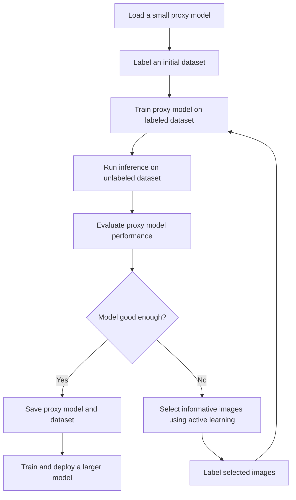
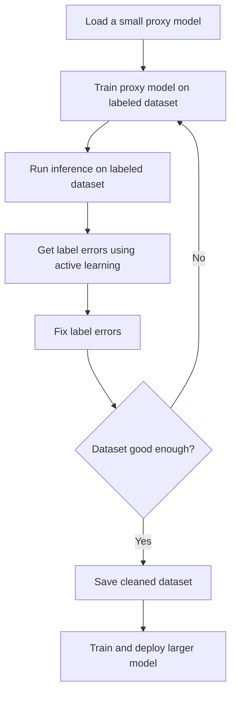

[](https://pypi.org/project/active-vision/)
[](https://pypi.org/project/active-vision/)
[](https://pypi.org/project/active-vision/)
[](https://github.com/dnth/active-vision/blob/main/LICENSE)

[colab_badge]: https://img.shields.io/badge/Open%20In-Colab-blue?style=for-the-badge&logo=google-colab
[kaggle_badge]: https://img.shields.io/badge/Open%20In-Kaggle-blue?style=for-the-badge&logo=kaggle

<p align="center">
  
    <br />
    <br />
    <a href="https://dnth.github.io/active-vision" target="_blank" rel="noopener noreferrer"><strong>Explore the docs »</strong></a>
    <br />
    <a href="#️-quickstart" target="_blank" rel="noopener noreferrer">Quickstart</a>
    ·
    <a href="https://github.com/dnth/active-vision/issues/new?assignees=&labels=Feature+Request&projects=&template=feature_request.md" target="_blank" rel="noopener noreferrer">Feature Request</a>
    ·
    <a href="https://github.com/dnth/active-vision/issues/new?assignees=&labels=bug&projects=&template=bug_report.md" target="_blank" rel="noopener noreferrer">Report Bug</a>
    ·
    <a href="https://github.com/dnth/active-vision/discussions" target="_blank" rel="noopener noreferrer">Discussions</a>
    ·
    <a href="https://dicksonneoh.com/" target="_blank" rel="noopener noreferrer">About</a>
</p>

The goal of this project is to create a framework for the active learning loop for computer vision. The diagram below shows a general workflow of how the active learning loop works.

<p align="center">
  
</p>

### Supported tasks:
- [X] Image classification
- [ ] Object detection
- [ ] Segmentation

### Supported models:
- [X] Fastai models
- [X] Torchvision models
- [X] Timm models
- [ ] Hugging Face models

### Supported Active Learning Strategies:

Uncertainty Sampling:
- [X] Least confidence
- [X] Margin of confidence
- [X] Ratio of confidence
- [X] Entropy

Diverse Sampling:
- [X] Random sampling
- [X] Model-based outlier
- [ ] Embeddings-based outlier
- [ ] Cluster-based
- [ ] Representative

## 📦 Installation

Get a release from PyPI
```bash
pip install active-vision
```

Install from source
```bash
git clone https://github.com/dnth/active-vision.git
cd active-vision
pip install -e .
```


> [!TIP]
> I recommend using [uv](https://docs.astral.sh/uv/) to set up a virtual environment and install the package. You can also use other virtual env of your choice.
> 
> If you're using uv:
> 
> ```bash
> uv venv
> uv sync
> ```
> Once the virtual environment is created, you can install the package using pip.
>
> If you're using uv add a `uv` before the pip install command to install into your virtual environment. Eg:
> ```bash
> uv pip install active-vision
> ```

## 🚀 Quickstart

[![Open In Colab][colab_badge]](https://colab.research.google.com/github/dnth/active-vision/blob/main/nbs/imagenette/quickstart.ipynb)
[![Open In Kaggle][kaggle_badge]](https://kaggle.com/kernels/welcome?src=https://github.com/dnth/active-vision/blob/main/nbs/imagenette/quickstart.ipynb)

The following are code snippets for the active learning loop in active-vision. I recommend running the quickstart notebook in Colab or Kaggle to see the full workflow.

```python
from active_vision import ActiveLearner

# Create an active learner instance
al = ActiveLearner(name="cycle-1")

# Load model
al.load_model(model="resnet18", pretrained=True)

# Load dataset 
al.load_dataset(train_df, filepath_col="filepath", label_col="label", batch_size=8)

# Train model
al.train(epochs=10, lr=5e-3)

# Evaluate the model on a *labeled* evaluation set
accuracy = al.evaluate(eval_df, filepath_col="filepath", label_col="label")

# Get summary of the active learning cycle
al.summary()

# Get predictions from an *unlabeled* set
pred_df = al.predict(filepaths)

# Sample images using a combination of active learning strategies
samples = al.sample_combination(
    pred_df,
    num_samples=50,
    combination={
        "least-confidence": 0.4,
        "ratio-of-confidence": 0.2,
        "entropy": 0.2,
        "model-based-outlier": 0.1,
        "random": 0.1,
    },
)

# Launch a Gradio UI to label the samples, save the labeled samples to a file
al.label(samples, output_filename="samples.parquet")
```


In the UI, you can optionally run zero-shot inference on the image. This will use a VLM to predict the label of the image. There are a dozen VLM models as supported in the [x.infer project](https://github.com/dnth/x.infer).


Once complete, the labeled samples will be save into a new df.
We can now add the newly labeled data to the training set.

```python
al.add_to_dataset(labeled_df, output_filename="active_labeled.parquet")
```

Repeat the process until the model is good enough. Use the dataset to train a larger model and deploy.


## 📊 Benchmarks
This section contains the benchmarks I ran using the active learning loop on various datasets.

Column description:
- `#Labeled Images`: The number of labeled images used to train the model.
- `Evaluation Accuracy`: The accuracy of the model on the evaluation set.
- `Train Epochs`: The number of epochs used to train the model.
- `Model`: The model used to train.
- `Active Learning`: Whether active learning was used to train the model.
- `Source`: The source of the results.

### Imagenette
- num classes: 10
- num images: 9469

To start the active learning loop, I labeled 100 images (10 images from each class) and iteratively relabeled the most informative images until I hit 275 labeled images. 

The active learning loop is a iterative process and can keep going until you hit a stopping point. You can decide your own stopping point based on your use case. It could be:
- You ran out of data to label.
- You hit a performance goal.
- You hit a budget.
- Other criteria.

For this dataset, I decided to stop the active learning loop at 275 labeled images because the performance on the evaluation set exceeds the top performing model on the leaderboard. 


| #Labeled Images 	| Evaluation Accuracy 	| Train Epochs 	| Model                	| Active Learning 	| Source                                                                              	|
|----------------:	|--------------------:	|-------------:	|----------------------	|:---------------:	|-------------------------------------------------------------------------------------	|
| 9469            	| 94.90%              	| 80           	| xse_resnext50        	| ❌                | [Link](https://github.com/fastai/imagenette)                                        	 |
| 9469            	| 95.11%              	| 200          	| xse_resnext50        	| ❌                | [Link](https://github.com/fastai/imagenette)                                        	 |
| 275             	| 99.33%              	| 6            	| convnext_small_in22k 	| ✓               	| [Link](https://github.com/dnth/active-vision/blob/main/nbs/05_retrain_larger.ipynb) 	|
| 275             	| 93.40%              	| 4            	| resnet18             	| ✓               	| [Link](https://github.com/dnth/active-vision/blob/main/nbs/04_relabel_loop.ipynb)   	|

### Dog Food
- num classes: 2
- num images: 2100

To start the active learning loop, I labeled 20 images (10 images from each class) and iteratively relabeled the most informative images until I hit 160 labeled images. 

I decided to stop the active learning loop at 160 labeled images because the performance on the evaluation set is close to the top performing model on the leaderboard. You can decide your own stopping point based on your use case.

| #Labeled Images 	| Evaluation Accuracy 	| Train Epochs 	| Model                	| Active Learning 	| Source                                                                                      	|
|----------------:	|--------------------:	|-------------:	|----------------------	|:---------------:	|---------------------------------------------------------------------------------------------	|
| 2100            	| 99.70%              	| ?            	| vit-base-patch16-224 	| ❌               	| [Link](https://huggingface.co/abhishek/autotrain-dog-vs-food)                               	|
| 160             	| 100.00%             	| 6            	| convnext_small_in22k 	| ✓               	| [Link](https://github.com/dnth/active-vision/blob/main/nbs/dog_food_dataset/02_train.ipynb) 	|
| 160             	| 97.60%              	| 4            	| resnet18             	| ✓               	| [Link](https://github.com/dnth/active-vision/blob/main/nbs/dog_food_dataset/01_label.ipynb) 	|

### Oxford-IIIT Pet
- num classes: 37
- num images: 3680

To start the active learning loop, I labeled 370 images (10 images from each class) and iteratively relabeled the most informative images until I hit 612 labeled images. 

I decided to stop the active learning loop at 612 labeled images because the performance on the evaluation set is close to the top performing model on the leaderboard. You can decide your own stopping point based on your use case.

| #Labeled Images 	| Evaluation Accuracy 	| Train Epochs 	| Model                	| Active Learning 	| Source                                                                                          	|
|----------------:	|--------------------:	|-------------:	|----------------------	|:---------------:	|-------------------------------------------------------------------------------------------------	|
| 3680            	| 95.40%              	| 5            	| vit-base-patch16-224 	| ❌                | [Link](https://huggingface.co/walterg777/vit-base-oxford-iiit-pets)                             	 |
| 612             	| 90.26%              	| 11           	| convnext_small_in22k 	| ✓               	| [Link](https://github.com/dnth/active-vision/blob/main/nbs/oxford_iiit_pets/02_train.ipynb)     	|
| 612             	| 91.38%              	| 11           	| vit-base-patch16-224 	| ✓               	| [Link](https://github.com/dnth/active-vision/blob/main/nbs/oxford_iiit_pets/03_train_vit.ipynb) 	|

### Eurosat RGB
- num classes: 10
- num images: 16100

To start the active learning loop, I labeled 100 images (10 images from each class) and iteratively labeled the most informative images until I hit 1188 labeled images. 

I decided to stop the active learning loop at 1188 labeled images because the performance on the evaluation set is close to the top performing model on the leaderboard. You can decide your own stopping point based on your use case.


| #Labeled Images 	| Evaluation Accuracy 	| Train Epochs 	| Model                	| Active Learning 	| Source                                                                                     	|
|----------------:	|--------------------:	|-------------:	|----------------------	|:---------------:	|--------------------------------------------------------------------------------------------	|
| 16100           	| 98.55%              	| 6            	| vit-base-patch16-224 	| ❌                | [Link](https://github.com/dnth/active-vision/blob/main/nbs/eurosat_rgb/03_train_all.ipynb)  |
| 1188            	| 94.59%              	| 6            	| vit-base-patch16-224 	| ✓               	| [Link](https://github.com/dnth/active-vision/blob/main/nbs/eurosat_rgb/02_train.ipynb)     	|
| 1188            	| 96.57%              	| 13           	| vit-base-patch16-224 	| ✓               	| [Link](https://github.com/dnth/active-vision/blob/main/nbs/eurosat_rgb/02_train.ipynb)     	|


## ➿ Workflow
This section describes a more detailed workflow for active learning. There are two workflows for active learning that we can use depending on the availability of labeled data.

### With unlabeled data
If we have no labeled data, the goal of the active learning loop is to build a resonably good labeled dataset to train a larger model.

Steps:

1. Load a small proxy model.
2. Label an initial dataset. If there is none, you'll have to label some images.
3. Train the proxy model on the labeled dataset.
4. Run inference on the unlabeled dataset.
5. Evaluate the performance of the proxy model.
6. Is model good enough?    
    - Yes: Save the proxy model and the dataset.
    - No: Select the most informative images to label using active learning.
7. Label the most informative images and add them to the dataset.
8. Repeat steps 3-6.
9. Save the proxy model and the dataset.
10. Train a larger model on the saved dataset.



    
### With labeled data
If we already have a labeled dataset, the goal of the active learning loop is to iteratively improve the dataset and the model by fixing the most important label errors.

Steps:

1. Load a small proxy model.
2. Train the proxy model on the labeled dataset.
3. Run inference on the entire labeled dataset.
4. Get the most impactful label errors with active learning.
5. Fix the label errors.
6. Repeat steps 2-5 until the dataset is good enough.
7. Save the labeled dataset.
8. Train a larger model on the saved labeled dataset.





## 🧱 Sampling Approaches

Recommendation 1:
- 10% randomly selected from unlabeled items.
- 80% selected from the lowest confidence items.
- 10% selected as outliers.

Recommendation 2:

- Sample 100 predicted images at 10–20% confidence.
- Sample 100 predicted images at 20–30% confidence.
- Sample 100 predicted images at 30–40% confidence, and so on.


Uncertainty and diversity sampling are most effective when combined. For instance, you could first sample the most uncertain items using an uncertainty sampling method, then apply a diversity sampling method such as clustering to select a diverse set from the uncertain items.

Ultimately, the right ratios can depend on the specific task and dataset.

