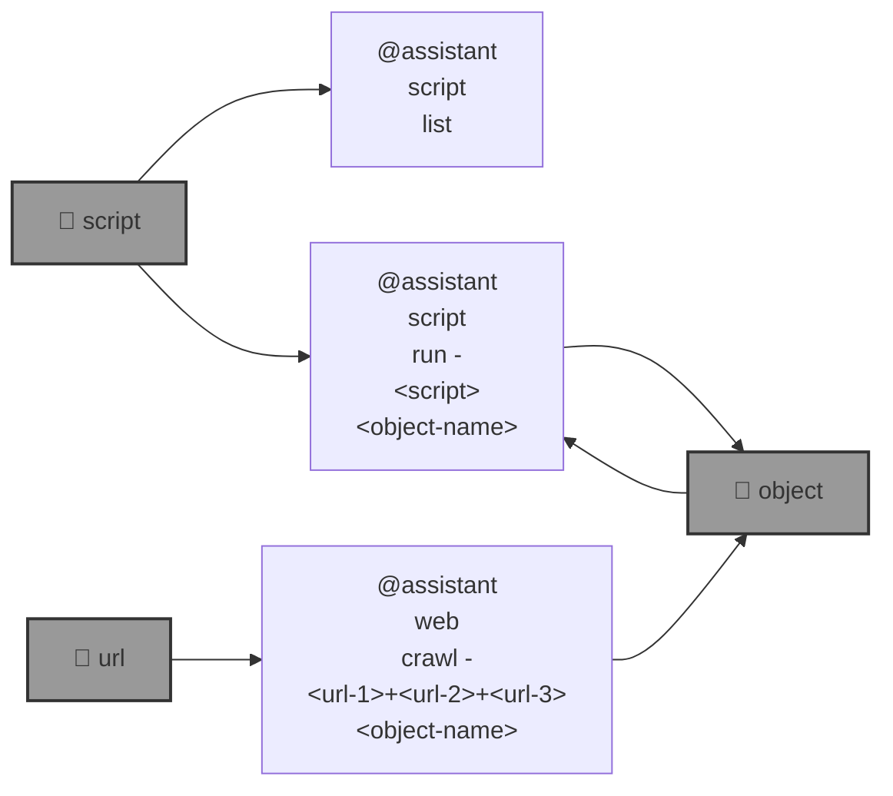

# 🧠 blue-assistant

🧠 `@assistant` runs AI scripts; DAGs that combine deterministic and AI operations.

|   |   |
| --- | --- |
| [`orbital-data-explorer`](./blue_assistant/script/repository/orbital_data_explorer/README.md) [](./blue_assistant/script/repository/orbital_data_explorer/README.md) Access to the [Orbital Data Explorer](https://ode.rsl.wustl.edu/), through AI. | [`blue-amo`](./blue_assistant/script/repository/blue_amo/README.md) [](./blue_assistant/script/repository/blue_amo/README.md) A story developed and visualized, by AI. |

```bash
pip install blue-assistant
```



---


[](https://github.com/kamangir/blue-assistant/actions/workflows/pylint.yml) [](https://github.com/kamangir/blue-assistant/actions/workflows/pytest.yml) [](https://github.com/kamangir/blue-assistant/actions/workflows/bashtest.yml) [](https://pypi.org/project/blue-assistant/) [](https://pypistats.org/packages/blue-assistant)

built by 🌀 [`blue_options-4.207.1`](https://github.com/kamangir/awesome-bash-cli), based on 🧠 [`blue_assistant-4.160.1`](https://github.com/kamangir/blue-assistant).
