# 🌀 blue-sbc

🌀 `@sbc` is an [`abcli`](https://github.com/kamangir/awesome-bash-cli) plugin for edge computing on [single board computers](https://github.com/kamangir/blue-bracket). 

```bash
pip install blue_sbc

# @env dot list
@env dot cp <env-name> local
```

|   |   |   |   |
| --- | --- | --- | --- |

```mermaid
graph LR
    camera["@sbc<br>&lt;camera&gt;<br>capture|preview<br>image|video"]

    hardware_validate["@sbc<br>&lt;hardware&gt;<br>validate<br>&lt;options&gt;"]

    session_start["@sbc<br>session<br>start"]

    object["📂 object"]:::folder
    camera_hardware["👁️‍🗨️ camera"]:::folder
    hardware["🖱️ hardware"]:::folder
    UI["💻 UI"]:::folder

    camera_hardware --> camera
    camera --> object
    camera --> UI

    hardware --> hardware_validate
    hardware_validate --> hardware
    hardware_validate --> UI

    hardware --> session_start
    session_start --> hardware
    camera_hardware --> session_start
    session_start --> object
    session_start --> UI

    classDef folder fill:#999,stroke:#333,stroke-width:2px;
```

| [](https://github.com/kamangir/blue-bracket/blob/main/designs/blue3.md) | [](https://github.com/kamangir/blue-bracket/blob/main/designs/chenar-grove.md) | [](https://github.com/kamangir/blue-bracket/blob/main/designs/cube.md) | [](https://github.com/kamangir/blue-bracket/blob/main/designs/eye_nano.md) |



# branches

- [current](.) active and default branch.
- [main](https://github.com/kamangir/blue-sbc/tree/main) legacy branch, is running on [a cluster of Raspberry pis](https://github.com/kamangir/blue-bracket). ⚠️ do not touch. ⚠️

---


[](https://github.com/kamangir/blue-sbc/actions/workflows/pylint.yml) [](https://github.com/kamangir/blue-sbc/actions/workflows/pytest.yml) [](https://github.com/kamangir/blue-sbc/actions/workflows/bashtest.yml) [](https://pypi.org/project/blue-sbc/) [](https://pypistats.org/packages/blue-sbc)

built by 🌀 [`blue_options-4.221.1`](https://github.com/kamangir/awesome-bash-cli), based on 🌀 [`blue_sbc-7.70.1`](https://github.com/kamangir/blue-sbc).


