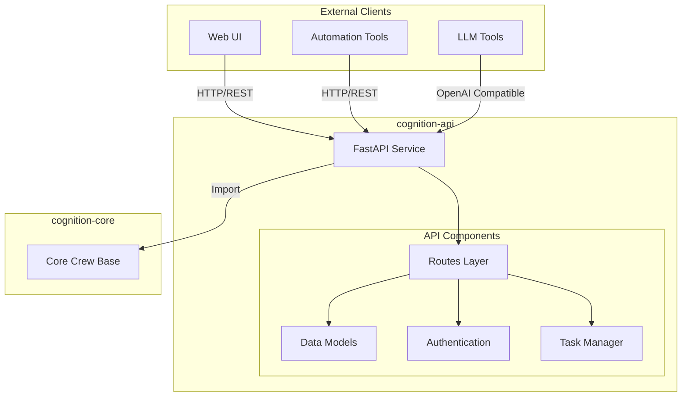

# Cognition API

REST API service for Cognition Core AI agents, providing HTTP endpoints and OpenAI-compatible interfaces for AI agent interactions.

## 🏗️ Architecture



## 🚀 Quick Start

### Installation

```bash
# Clone the repository
git clone https://github.com/yourusername/cognition-api.git
cd cognition-api

# Create and activate virtual environment
python -m venv venv
source venv/bin/activate  # On Windows: venv\Scripts\activate

# Install dependencies
pip install -e .
```

### Running the API

```bash
# Development
uvicorn cognition_api.service:app --reload --port 8000

# Production
uvicorn cognition_api.service:app --host 0.0.0.0 --port 8000 --workers 4
```

## 🔌 API Endpoints

### Standard REST Endpoints

```bash
POST /v1/agent/run
GET /v1/agent/task/{task_id}
```

### OpenAI Compatible Endpoints

```bash
POST /v1/chat/completions
```

## 📝 Usage Examples

### Direct API Usage

```python
import httpx
import asyncio

async def run_task():
    async with httpx.AsyncClient() as client:
        response = await client.post(
            "http://localhost:8000/v1/agent/run",
            json={
                "task": "research",
                "inputs": {"topic": "AI agents"},
                "async_execution": True
            }
        )
        return response.json()

asyncio.run(run_task())
```

### OpenAI Compatible Usage

```python
from openai import AsyncOpenAI

client = AsyncOpenAI(
    base_url="http://localhost:8000/v1",
    api_key="your-api-key"
)

async def chat():
    response = await client.chat.completions.create(
        model="gpt-4",
        messages=[
            {"role": "user", "content": "Research AI agents"}
        ]
    )
    return response.choices[0].message.content
```

## ⚙️ Configuration

Configuration is managed through YAML files and environment variables:

```yaml
# config/api.yaml
server:
  host: "0.0.0.0"
  port: 8000
  workers: 4

security:
  api_key_header: "X-API-Key"
  allowed_keys: []  # Set via environment

endpoints:
  agent:
    rate_limit: 100
    timeout: 300
```

### Environment Variables

```bash
COGNITION_API_KEY=your-api-key
COGNITION_CORE_CONFIG_DIR=/path/to/config
COGNITION_API_PORT=8000
```

## 🔒 Security

- API key authentication
- Rate limiting
- CORS configuration
- Request validation

## 🔍 Monitoring

The API provides several monitoring endpoints:

```bash
GET /health
GET /metrics
GET /docs  # Swagger UI
GET /redoc  # ReDoc documentation
```

## 🧪 Testing

```bash
# Run tests
pytest

# Run with coverage
pytest --cov=cognition_api

# Run specific test file
pytest tests/test_agent_routes.py
```

## 📦 Dependencies

- FastAPI: Web framework
- Uvicorn: ASGI server
- Pydantic: Data validation
- HTTPX: HTTP client
- Cognition Core: AI agent framework

## 🤝 Contributing

1. Fork the repository
2. Create a feature branch
3. Make your changes
4. Run tests
5. Submit a pull request

## 📄 License

MIT License - see [LICENSE](LICENSE) for details

## 🔗 Related Projects

- [Cognition Core](https://github.com/yourusername/cognition-core)
- [Cognition UI](https://github.com/yourusername/cognition-ui)

## 📚 Documentation

Full documentation is available at [docs.cognition-api.com](https://docs.cognition-api.com)

## 🛣️ Roadmap

- [ ] WebSocket support for real-time updates
- [ ] GraphQL endpoint
- [ ] Enhanced monitoring and logging
- [ ] Docker containerization
- [ ] Kubernetes deployment manifests

## 📞 Support

- GitHub Issues: For bug reports and feature requests
- Discord: Join our [community](https://discord.gg/cognition)
- Email: support@cognition-api.com

## ✨ Contributors

<table>
  <tr>
    <td align="center">
      <a href="https://github.com/yourusername">
        
        <br />
        <sub><b>Your Name</b></sub>
      </a>
    </td>
  </tr>
</table>
```

This README provides:
1. Clear architecture overview
2. Quick start guide
3. Usage examples
4. Configuration details
5. Security information
6. Testing instructions
7. Contributing guidelines
8. Future roadmap
9. Support channels

Would you like me to expand on any section or add additional information?