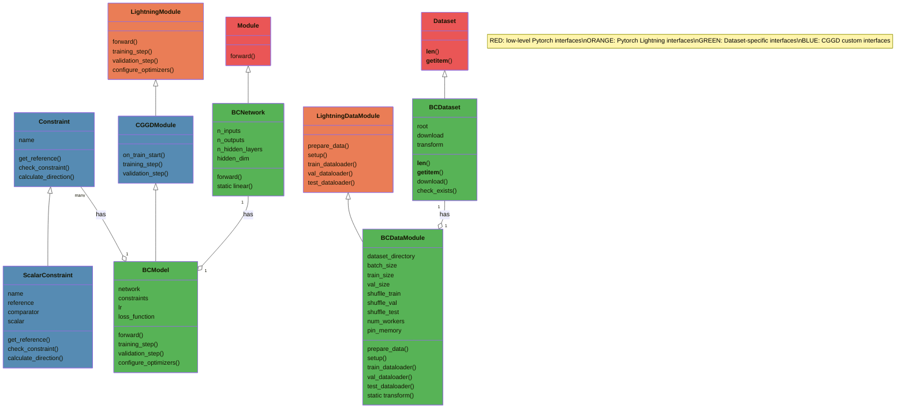

```mermaid

classDiagram

    Constraint <|-- ScalarConstraint

    class Constraint {
        name
        get_reference()
        check_constraint()
        calculate_direction()
    }

    class ScalarConstraint {
        name
        reference
        comparator
        scalar
        get_reference()
        check_constraint()
        calculate_direction()
    }


    LightningModule <|-- CGGDModule

    class CGGDModule {
        on_train_start()
        training_step()
        validation_step()
    }


    Module <|-- BCNetwork

    class Module {
        forward()
    }

    class BCNetwork {
        n_inputs
        n_outputs
        n_hidden_layers
        hidden_dim
        forward()
        static linear()
    }


    CGGDModule <|-- BCModel

    class LightningModule {
        forward()
        training_step()
        validation_step()
        configure_optimizers()
    }

    class BCModel {
        network
        constraints
        lr
        loss_function
        forward()
        training_step()
        validation_step()
        configure_optimizers()
    }


    LightningDataModule <|-- BCDataModule

    class LightningDataModule{
      prepare_data()
      setup()
      train_dataloader()
      val_dataloader()
      test_dataloader()
    }

    class BCDataModule{
        dataset_directory
        batch_size
        train_size
        val_size
        shuflle_train
        shuffle_val
        shuffle_test
        num_workers
        pin_memory
        prepare_data()
        setup()
        train_dataloader()
        val_dataloader()
        test_dataloader()
        static transform()
    }


    Dataset <|-- BCDataset

    class Dataset {
        __len__()
        __getitem__()
    }
    class BCDataset{
        root
        download
        transform
        __len__()
        __getitem__()
        download()
        check_exists()
    }

    Constraint "many" --o "1" BCModel : has
    BCNetwork "1" --o "1" BCModel : has
    BCDataset "1" --o "1" BCDataModule : has


    note "RED: low-level Pytorch interfaces\nORANGE: Pytorch Lightning interfaces\nGREEN: Dataset-specific interfaces\nBLUE: CGGD custom interfaces"

    style Module fill:#ea5656
    style Dataset fill:#ea5656
    style LightningDataModule fill:#ea7d56
    style LightningModule fill:#ea7d56
    style BCModel fill:#57b356
    style BCNetwork fill:#57b356
    style BCDataset fill:#57b356
    style BCDataModule fill:#57b356
    style CGGDModule fill:#568bb3
    style Constraint fill:#568bb3
    style ScalarConstraint fill:#568bb3

```
