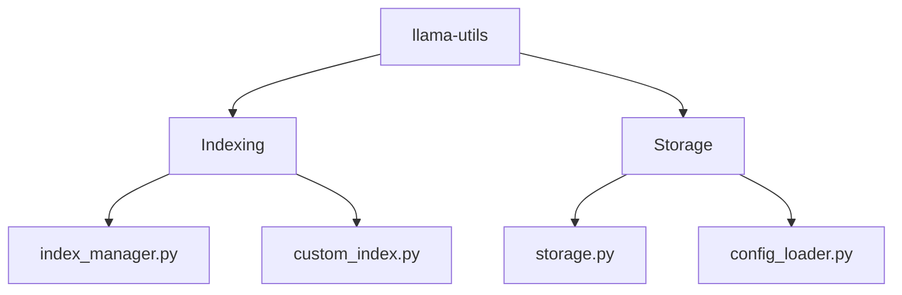

# llama-utils
LlamaIndex utility package

[](https://github.com/Serapieum-of-alex/llama-utils/actions/workflows/github-pages-mkdocs.yml)


[](https://www.gnu.org/licenses/gpl-3.0)
[](https://github.com/pre-commit/pre-commit)
[](https://lgtm.com/projects/g/MAfarrag/llama-utils/context:python)


[](https://codecov.io/gh/Serapieum-of-alex/llama-utils)

[](https://www.codacy.com/gh/Serapieum-of-alex/llama-utils/dashboard?utm_source=github.com&amp;utm_medium=referral&amp;utm_content=Serapieum-of-alex/llama-utils&amp;utm_campaign=Badge_Grade)


Current release info
====================

| Name                                                                                                                 | Downloads                                                                                                                                                                                                                                                                                                                                                                                                                                                                                                                   | Version                                                                                                                                                                                                                     | Platforms                                                                                                                                                                                                                                                                                                                                 |
|----------------------------------------------------------------------------------------------------------------------|-----------------------------------------------------------------------------------------------------------------------------------------------------------------------------------------------------------------------------------------------------------------------------------------------------------------------------------------------------------------------------------------------------------------------------------------------------------------------------------------------------------------------------|-----------------------------------------------------------------------------------------------------------------------------------------------------------------------------------------------------------------------------|-------------------------------------------------------------------------------------------------------------------------------------------------------------------------------------------------------------------------------------------------------------------------------------------------------------------------------------------|
| [](https://anaconda.org/conda-forge/llama-utils) | [](https://anaconda.org/conda-forge/llama-utils) [](https://pepy.tech/project/llama-utils) [](https://pepy.tech/project/llama-utils)  [](https://pepy.tech/project/llama-utils)   | [](https://anaconda.org/conda-forge/llama-utils) [](https://badge.fury.io/py/llama-utils) | [](https://anaconda.org/conda-forge/llama-utils) [](https://gitter.im/Hapi-Nile/Hapi?utm_source=badge&utm_medium=badge&utm_campaign=pr-badge&utm_content=badge) |

llama-utils - Large Language Model Utility Package
=====================================================================
**llama-utils** is a large language model utility package


Main Features
-------------

- llama-index

Package Overview
----------------



complete overview of the design and architecture [here](/docs/design-architecture-diagrams.md)

Installing llama-utils
===============

Installing `llama-utils` from the `conda-forge` channel can be achieved by:

```
conda install -c conda-forge llama-utils=0.3.0
```

It is possible to list all the versions of `llama-utils` available on your platform with:

```
conda search llama-utils --channel conda-forge
```

## Install from GitHub

to install the last development to time, you can install the library from GitHub

```
pip install git+https://github.com/Serapieum-of-alex/llama-utils
```

## pip

to install the last release, you can easily use pip

```
pip install llama-utils==0.3.0
```

Quick start
===========
- First download ollama from here [ollama](https://ollama.com/download) and install it.
- Then run the following command to pull the `llama3` model
```
ollama pull llama3
```
- Then run ollama server (if you get an error, check the errors section below to solve it)
```
ollama serve
```
Now you can use the `llama-utils` package to interact with the `ollama` server

```python
from llama_utils.retrieval.storage import Storage
STORAGE_DIR= "examples/data/llama3"
storage = Storage.create()
data_path = "examples/data/essay"
docs = storage.read_documents(data_path)
storage.add_documents(docs)
storage.save(STORAGE_DIR)
```


Errors
======
You might face the following error when you run the `ollama serve` command
```bash
Error: listen tcp 127.0.0.1:11434: bind: Only one usage of each socket address (protocol/network address/port) is normally permitted.
```
This error is due to the port `11434` is already in use, to solve this error, you can check which process is using this port by running the following command
```bash
netstat -ano | findstr :11434
```
You will get the following output
```bash
    TCP    127.0.0.1:11434        0.0.0.0:0              LISTENING       20796
```
Then you can kill the process by running the following command
```bash
taskkill /F /PID 20796
```
you will gee the following output
```bash
SUCCESS: The process with PID 20796 has been terminated.
```

- Then you can run the `ollama serve` command again, you should see the following output
```bash
2024/11/22 23:20:04 routes.go:1189: INFO server config env="map[CUDA_VISIBLE_DEVICES: GPU_DEVICE_ORDINAL: HIP_VISIBLE_DEVICES: HSA_OVERRIDE_GFX_VERSION: HTTPS_PROXY: HTTP_PROXY: NO_PROXY: OLLAMA_DEBUG:false OLLAMA_FLASH_ATTENTION:false OLLAMA_GPU_OVERHEAD:0 OLLAMA_HOST:http://127.0.0.1:11434 OLLAMA_INTEL_GPU:false OLLAMA_KEEP_ALIVE:5m0s OLLAMA_LLM_LIBRARY: OLLAMA_LOAD_TIMEOUT:5m0s OLLAMA_MAX_LOADED_MODELS:0 OLLAMA_MAX_QUEUE:512 OLLAMA_MODELS:C:\\Users\\eng_m\\.ollama\\models OLLAMA_MULTIUSER_CACHE:false OLLAMA_NOHISTORY:false OLLAMA_NOPRUNE:false OLLAMA_NUM_PARALLEL:0 OLLAMA_ORIGINS:[http://localhost https://localhost http://localhost:* https://localhost:* http://127.0.0.1 https://127.0.0.1 http://127.0.0.1:* https://127.0.0.1:* http://0.0.0.0 https://0.0.0.0 http://0.0.0.0:* https://0.0.0.0:* app://* file://* tauri://* vscode-webview://*] OLLAMA_SCHED_SPREAD:false OLLAMA_TMPDIR: ROCR_VISIBLE_DEVICES:]"
time=2024-11-22T23:20:04.393+01:00 level=INFO source=images.go:755 msg="total blobs: 28"
time=2024-11-22T23:20:04.395+01:00 level=INFO source=images.go:762 msg="total unused blobs removed: 0"
time=2024-11-22T23:20:04.397+01:00 level=INFO source=routes.go:1240 msg="Listening on 127.0.0.1:11434 (version 0.4.1)"
time=2024-11-22T23:20:04.400+01:00 level=INFO source=common.go:49 msg="Dynamic LLM libraries" runners="[cpu cpu_avx cpu_avx2 cuda_v11 cuda_v12 rocm]"
time=2024-11-22T23:20:04.400+01:00 level=INFO source=gpu.go:221 msg="looking for compatible GPUs"
time=2024-11-22T23:20:04.400+01:00 level=INFO source=gpu_windows.go:167 msg=packages count=1
time=2024-11-22T23:20:04.400+01:00 level=INFO source=gpu_windows.go:214 msg="" package=0 cores=8 efficiency=0 threads=16
time=2024-11-22T23:20:04.592+01:00 level=INFO source=types.go:123 msg="inference compute" id=GPU-04f76f9a-be0a-544b-9a6f-8607b8d0a9ab library=cuda variant=v12 compute=8.6 driver=12.6 name="NVIDIA GeForce RTX 3060 Ti" total="8.0 GiB" available="7.0 GiB"
```

you can change the port by running the following command
`ollama serve --port 11435`
