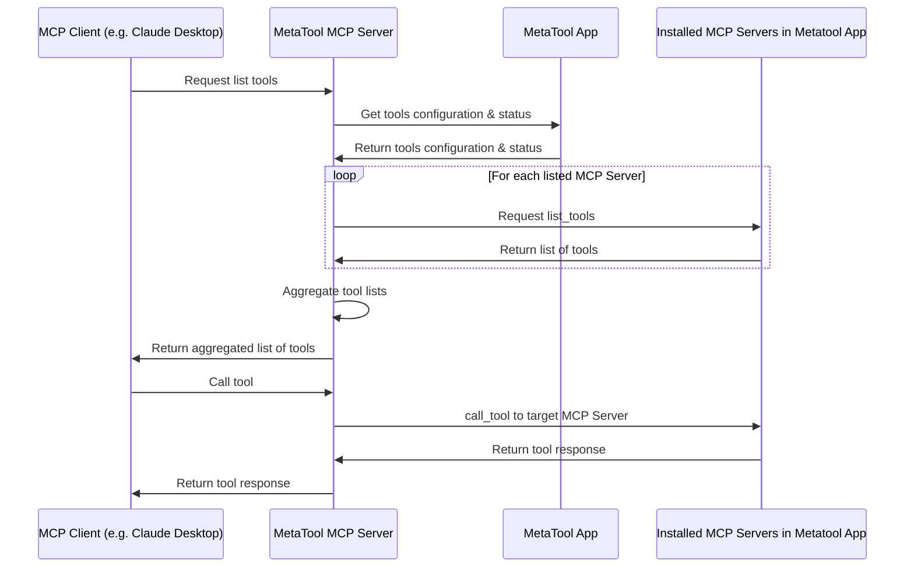

# MCP Server MetaTool

## Overview

Metatool MCP Server is a proxy server that joins multiple MCP servers and forward tool calls to the appropriate server.
It should be used with [metatool-app](https://github.com/metatool-ai/metatool-app), the GUI tool manager for MCP which is also open source, together.



## How it works
- mcp-server-metatool itself is both a MCP client and a MCP server
- On startup, it connects to the metatool-app API to get a list of MCP servers to connect to
- On `list_tools` call of MCP, it joins all tools from all MCP servers with namespace isolation.
- On `call_tool` call of MCP, it forwards the call to the appropriate server.


## Installation

Best way to use this is through uv
A METATOOL_API_KEY environment variable must be set

```bash
export METATOOL_API_KEY="my_api_key" # get from metatool-ai/metatool-app, which is self hostable and free
uvx mcp-server-metatool
```

You need a MCP Client to connect to this server to use it.

## Additional Configuration

A METATOOL_API_BASE_URL environment variable can be set to point to another metatool instance

```bash
export METATOOL_API_BASE_URL="http://localhost:12005"
```

## License

Apache License 2.0
