```mermaid
flowchart LR
    %% Main System
    subgraph MeshOS[MeshOS System]
        direction LR

        %% Taxonomy Details
        subgraph Taxonomy[Memory Classification]
            direction TB
            
            subgraph DataTypes[Data Types]
                direction LR
                knowledge[Knowledge Type]
                activity[Activity Type]
                decision[Decision Type]
                media[Media Type]
            end

            subgraph Subtypes[Example Subtypes]
                direction LR
                k_types[Research/Mission/Vision]
                a_types[Conversations/Logs/Events]
                d_types[Policies/Strategies]
                m_types[Documents/Images]

                knowledge --> k_types
                activity --> a_types
                decision --> d_types
                media --> m_types
            end

            subgraph Relations[Edge Types]
                direction LR
                basic[related_to/version_of]
                semantic[influences/depends_on]
                temporal[follows_up/precedes]
            end
        end

        %% Memory Operations
        subgraph MemoryEngine[Memory Operations]
            direction LR
            rememberAction[Store/Remember]
            recallAction[Search/Recall]
            linkAction[Link Memories]
            versioning[Version Control]

            rememberAction --> recallAction
            recallAction --> linkAction
            linkAction --> versioning
        end
    end

    %% Organization & Agents
    subgraph Organization[Organization & Agents]
        direction TB

        %% Company Memory
        subgraph CompanyMemory[Company-Wide Memory]
            direction LR
            corpVision[Company Vision]
            corpMission[Company Mission]
            corpData[Knowledge Base]
        end

        %% Agents
        subgraph Agent1[Research Agent]
            a1Mem[Research Memories]
        end

        subgraph Agent2[Service Agent]
            a2Mem[Service Memories]
        end
    end

    %% System Connections
    Taxonomy --> MemoryEngine
    MemoryEngine --> Organization

    %% Memory Connections
    corpVision -.->|influences| a1Mem
    corpMission -.->|guides| a2Mem
    a1Mem -.->|shares| a2Mem
    a2Mem -.->|feedback| corpData
    a1Mem -.->|versions| corpData

    %% Styling
    classDef system fill:#dfeff9,stroke:#333,stroke-width:1.5px
    classDef engine fill:#fcf8e3,stroke:#333
    classDef taxonomy fill:#e7f5e9,stroke:#333
    classDef types fill:#f8f4ff,stroke:#333
    classDef org fill:#f4f4f4,stroke:#333

    class MeshOS system
    class MemoryEngine engine
    class Taxonomy,DataTypes,Subtypes,Relations taxonomy
    class Organization org
```

# MeshOS

**The Memory & Knowledge Engine for Multi-Agent Systems**

MeshOS is a **developer-first framework** for building **multi-agent AI-driven operations** with structured memory, knowledge retrieval, and real-time collaboration. Unlike generic memory stores, MeshOS is purpose-built for:

- **Autonomous Agents & Teams** – Agents and humans evolve a shared memory over time.
- **Graph-Based Memory** – Track relationships, dependencies, and evolving knowledge.
- **Fast Semantic Search** – Vector-based retrieval with **pgvector**.
- **Event-Driven Execution** – Automate workflows based on evolving context.
- **Versioned Knowledge** – Track updates, past decisions, and historical context.
- **Open & Portable** – Runs on **PostgreSQL + Hasura** with no vendor lock-in.

## Why MeshOS?

Most frameworks give you a **blob of memories**—MeshOS gives you **structured, evolving intelligence** with deep relationships and versioning.

| Feature                      | MeshOS | Mem0 / Letta / Zep |
| ---------------------------- | ------ | ------------------ |
| **Multi-Agent Memory**       | ✅ Yes  | ❌ No               |
| **Structured Taxonomy**      | ✅ Yes  | ❌ No               |
| **Versioned Knowledge**      | ✅ Yes  | ❌ No               |
| **Graph-Based Relationships** | ✅ Yes  | ❌ No               |
| **Semantic & Vector Search**  | ✅ Yes  | ✅ Partial          |
| **Event-Driven Execution**  | ✅ Yes  | ❌ No               |
| **Open-Source & Portable**   | ✅ Yes  | ✅ Partial          |

### **Who is MeshOS for?**

✅ **Builders of AI-powered operations** – Structured memory and decision-making for AI-driven systems.  
✅ **Multi-agent system developers** – AI agents that need to store, process, and evolve shared knowledge.  
✅ **Developers & engineers** – Wanting an **open-source, PostgreSQL-powered framework** with no lock-in.  

---



---

## Getting Started

### Install & Create a New Instance
```bash
pip install mesh-os
mesh-os create my-project && cd my-project
mesh-os up
```

## Usage
```python
from mesh_os import MeshOS

# Initialize MeshOS
os = MeshOS()

# Register an agent
agent = os.register_agent(name="AI_Explorer")

# Store structured knowledge
memory = os.remember(
    content="The Moon has water ice.",
    agent_id=agent.id,
    metadata={
        "type": "knowledge",
        "subtype": "fact",
        "tags": ["astronomy", "moon"],
        "version": 1
    }
)

# Retrieve similar knowledge
results = os.recall(query="Tell me about the Moon.")
```

---

## 🏗️ Core Features

✅ **Memory for Multi-Agent Systems** – Let agents store, retrieve, and link structured knowledge.  
✅ **Fast Semantic Search** – pgvector-powered similarity matching across all memories.  
✅ **Graph-Based Knowledge** – Build evolving relationships between facts, ideas, and actions.  
✅ **Versioning Built-In** – Track updates, past decisions, and context shifts.  
✅ **Event-Driven Execution** – Automate workflows based on new knowledge.  
✅ **Open & Portable** – Runs anywhere PostgreSQL does. No black-box infrastructure.  

---

## 🔗 Structured Taxonomy & Memory Graph

MeshOS **enforces structured knowledge** with **memory classification** and **versioning**:

| **Memory Type** | **Examples**                                 |
| --------------- | -------------------------------------------- |
| **Knowledge**   | Research reports, datasets, concepts        |
| **Activity**    | Agent workflows, logs, system events        |
| **Decision**    | Policy updates, business strategy           |
| **Media**       | Documents, images, AI-generated content     |

Memories **evolve** over time, with full versioning and relationship tracking.

---

## 🛠️ Development & Configuration

### **Configuration**
```ini
# Required
OPENAI_API_KEY=your_api_key_here

# Optional (defaults shown)
POSTGRES_PASSWORD=mysecretpassword
HASURA_ADMIN_SECRET=meshos
POSTGRES_PORT=5432
HASURA_PORT=8080
HASURA_ENABLE_CONSOLE=true
```

### **Development**
```bash
git clone https://github.com/yourusername/mesh-os.git
cd mesh-os
poetry install
poetry run pytest
```

### **Contributing**
Contributions are welcome! Please submit a Pull Request.

---

## ⚖️ License
This project is licensed under the Apache 2.0 License – see [LICENSE](./LICENSE) for details.

