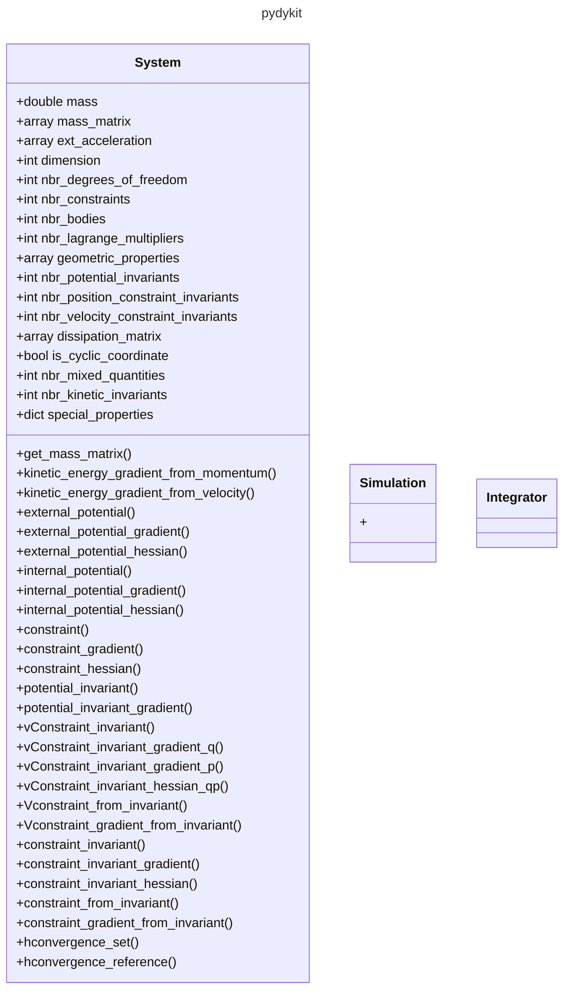

# Docs

## Build docs with `mkdocs`

Install

```bash
pip install -r requirements_mkdocs.txt
```

Create docs and serve on local URL (see termianl output for URL).

```bash
mkdocs serve
```

## Useful Links on the Docs

- [markdown-exec code examples](https://pawamoy.github.io/markdown-exec/gallery/#exec-9--source)
- [pymdown snippets location](https://facelessuser.github.io/pymdown-extensions/extensions/snippets/#specifying-snippet-locations)

## Visualize the Code Structure

Following this [stackoverflow contribution](https://stackoverflow.com/a/7554457/8935243)
we can use
[`pyreverse`](https://pylint.readthedocs.io/en/stable/pyreverse.html)
which ships with `pylint`. Additionally we will need `graphviz` to create png-files.

```bash
conda install pylint graphviz
```

to visualize our package `pydykit`.
Therefore, we navigate into the package

```bash
cd pydykit
```

and execute

```bash
pyreverse -p pydykit .
```

to generate a graphviz-dot-file which represents the structure of both the package and it's classes.

Example:



```dot
digraph "classes_pydykit" {
rankdir=BT
charset="utf-8"
"pydykit.integrators.EulerExplicit" [color="black", fontcolor="black", label=<{EulerExplicit|<br ALIGN="LEFT"/>|calc_residuum_tangent()<br ALIGN="LEFT"/>}>, shape="record", style="solid"];
"pydykit.integrators.EulerImplicit" [color="black", fontcolor="black", label=<{EulerImplicit|<br ALIGN="LEFT"/>|calc_residuum_tangent()<br ALIGN="LEFT"/>}>, shape="record", style="solid"];
"pydykit.time_steppers.FixedIncrementHittingEnd" [color="black", fontcolor="black", label=<{FixedIncrementHittingEnd|current_step<br ALIGN="LEFT"/>nbr_timesteps<br ALIGN="LEFT"/>times : ndarray<br ALIGN="LEFT"/>|identify_times()<br ALIGN="LEFT"/>make_steps()<br ALIGN="LEFT"/>}>, shape="record", style="solid"];
"pydykit.integrators.Midpoint" [color="black", fontcolor="black", label=<{Midpoint|<br ALIGN="LEFT"/>|calc_residuum(system, time_stepper, state_n, state_n1)<br ALIGN="LEFT"/>calc_residuum_tangent()<br ALIGN="LEFT"/>}>, shape="record", style="solid"];
"pydykit.examples.Manager" [color="black", fontcolor="black", label=<{Manager|examples : dict<br ALIGN="LEFT"/>|get_example(name)<br ALIGN="LEFT"/>list_examples()<br ALIGN="LEFT"/>load_examples()<br ALIGN="LEFT"/>}>, shape="record", style="solid"];
"pydykit.core.Manager" [color="black", fontcolor="black", label=<{Manager|configuration<br ALIGN="LEFT"/>content_config_file<br ALIGN="LEFT"/>name<br ALIGN="LEFT"/>path_config_file<br ALIGN="LEFT"/>|instantiate_classes()<br ALIGN="LEFT"/>manage()<br ALIGN="LEFT"/>read_config_file()<br ALIGN="LEFT"/>}>, shape="record", style="solid"];
"pydykit.integrators.Midpoint" [color="black", fontcolor="black", label=<{Midpoint|<br ALIGN="LEFT"/>|calc_residuum_tangent()<br ALIGN="LEFT"/>}>, shape="record", style="solid"];
"pydykit.integrators.MultiBodyIntegrator" [color="black", fontcolor="black", label=<{MultiBodyIntegrator|integrator_output : integrator_output<br ALIGN="LEFT"/>manager<br ALIGN="LEFT"/>|<I>calc_residuum_tangent</I>()<br ALIGN="LEFT"/>}>, shape="record", style="solid"];
"pydykit.systems.MultiBodySystem" [color="black", fontcolor="black", label=<{MultiBodySystem|manager<br ALIGN="LEFT"/>|<I>constraint</I>(q)<br ALIGN="LEFT"/><I>constraint_gradient</I>(q)<br ALIGN="LEFT"/><I>external_potential</I>(q)<br ALIGN="LEFT"/><I>external_potential_gradient</I>(q)<br ALIGN="LEFT"/><I>get_mass_matrix</I>(q)<br ALIGN="LEFT"/><I>initialize</I>()<br ALIGN="LEFT"/><I>internal_potential</I>(q)<br ALIGN="LEFT"/><I>internal_potential_gradient</I>(q)<br ALIGN="LEFT"/><I>kinetic_energy_gradient_from_momentum</I>(q, p)<br ALIGN="LEFT"/><I>kinetic_energy_gradient_from_velocity</I>(q, v)<br ALIGN="LEFT"/>}>, shape="record", style="solid"];
"pydykit.solvers.Newton" [color="black", fontcolor="black", label=<{Newton|<br ALIGN="LEFT"/>|newton_update()<br ALIGN="LEFT"/>solve()<br ALIGN="LEFT"/>}>, shape="record", style="solid"];
"pydykit.systems.Pendulum2D" [color="black", fontcolor="black", label=<{Pendulum2D|states<br ALIGN="LEFT"/>|decompose_state(state)<br ALIGN="LEFT"/>get_e_matrix(state)<br ALIGN="LEFT"/>get_j_matrix()<br ALIGN="LEFT"/>get_jacobian(state)<br ALIGN="LEFT"/>get_z_vector(state)<br ALIGN="LEFT"/>initialize()<br ALIGN="LEFT"/>}>, shape="record", style="solid"];
"pydykit.systems.Pendulum3DCartesian" [color="black", fontcolor="black", label=<{Pendulum3DCartesian|ext_acc : ndarray<br ALIGN="LEFT"/>length : ndarray<br ALIGN="LEFT"/>manager<br ALIGN="LEFT"/>states<br ALIGN="LEFT"/>|compose_state(q, p, lambd)<br ALIGN="LEFT"/>constraint(q)<br ALIGN="LEFT"/>constraint_gradient(q)<br ALIGN="LEFT"/>decompose_state(state)<br ALIGN="LEFT"/>external_potential(q)<br ALIGN="LEFT"/>external_potential_gradient(q)<br ALIGN="LEFT"/>get_mass_matrix(q)<br ALIGN="LEFT"/>initialize()<br ALIGN="LEFT"/>internal_potential()<br ALIGN="LEFT"/>internal_potential_gradient(q)<br ALIGN="LEFT"/>kinetic_energy_gradient_from_momentum(q, p)<br ALIGN="LEFT"/>kinetic_energy_gradient_from_velocity(q, v)<br ALIGN="LEFT"/>}>, shape="record", style="solid"];
"pydykit.integrators.PortHamiltoniaIntegrator" [color="black", fontcolor="black", label=<{PortHamiltoniaIntegrator|integrator_output : integrator_output<br ALIGN="LEFT"/>manager<br ALIGN="LEFT"/>|<I>calc_residuum_tangent</I>()<br ALIGN="LEFT"/>}>, shape="record", style="solid"];
"pydykit.systems.PortHamiltonianSystem" [color="black", fontcolor="black", label=<{PortHamiltonianSystem|manager<br ALIGN="LEFT"/>|<I>get_e_matrix</I>(state)<br ALIGN="LEFT"/><I>get_j_matrix</I>()<br ALIGN="LEFT"/><I>get_jacobian</I>(state)<br ALIGN="LEFT"/><I>get_z_vector</I>(state)<br ALIGN="LEFT"/><I>initialize</I>()<br ALIGN="LEFT"/>}>, shape="record", style="solid"];
"pydykit.utils.pydykitException" [color="black", fontcolor="red", label=<{pydykitException|<br ALIGN="LEFT"/>|}>, shape="record", style="solid"];
"pydykit.solvers.Solver" [color="black", fontcolor="black", label=<{Solver|manager<br ALIGN="LEFT"/>|<I>solve</I>(state_initial)<br ALIGN="LEFT"/>}>, shape="record", style="solid"];
"pydykit.states.State" [color="black", fontcolor="black", label=<{State|columns<br ALIGN="LEFT"/>state : ndarray<br ALIGN="LEFT"/>state_n : ndarray<br ALIGN="LEFT"/>state_n1 : ndarray<br ALIGN="LEFT"/>time : ndarray<br ALIGN="LEFT"/>|to_df()<br ALIGN="LEFT"/>}>, shape="record", style="solid"];
"pydykit.time_steppers.TimeStep" [color="black", fontcolor="black", label=<{TimeStep|index<br ALIGN="LEFT"/>last_increment<br ALIGN="LEFT"/>time<br ALIGN="LEFT"/>|}>, shape="record", style="solid"];
"pydykit.time_steppers.TimeStepper" [color="black", fontcolor="black", label=<{TimeStepper|current_step<br ALIGN="LEFT"/>manager<br ALIGN="LEFT"/>|<I>make_steps</I>(): Iterator[TimeStep]<br ALIGN="LEFT"/>}>, shape="record", style="solid"];
"pydykit.integrators.EulerExplicit" -> "pydykit.integrators.PortHamiltoniaIntegrator" [arrowhead="empty", arrowtail="none"];
"pydykit.integrators.EulerImplicit" -> "pydykit.integrators.PortHamiltoniaIntegrator" [arrowhead="empty", arrowtail="none"];
"pydykit.integrators.Midpoint" -> "pydykit.integrators.MultiBodyIntegrator" [arrowhead="empty", arrowtail="none"];
"pydykit.integrators.Midpoint" -> "pydykit.integrators.PortHamiltoniaIntegrator" [arrowhead="empty", arrowtail="none"];
"pydykit.solvers.Newton" -> "pydykit.solvers.Solver" [arrowhead="empty", arrowtail="none"];
"pydykit.systems.Pendulum2D" -> "pydykit.systems.PortHamiltonianSystem" [arrowhead="empty", arrowtail="none"];
"pydykit.systems.Pendulum3DCartesian" -> "pydykit.systems.MultiBodySystem" [arrowhead="empty", arrowtail="none"];
"pydykit.time_steppers.FixedIncrementHittingEnd" -> "pydykit.time_steppers.TimeStepper" [arrowhead="empty", arrowtail="none"];
"pydykit.states.State" -> "pydykit.systems.Pendulum2D" [arrowhead="diamond", arrowtail="none", fontcolor="green", label="states", style="solid"];
"pydykit.states.State" -> "pydykit.systems.Pendulum3DCartesian" [arrowhead="diamond", arrowtail="none", fontcolor="green", label="states", style="solid"];
"pydykit.time_steppers.TimeStep" -> "pydykit.time_steppers.FixedIncrementHittingEnd" [arrowhead="diamond", arrowtail="none", fontcolor="green", label="_current_step", style="solid"];
}
```

This dot-file can be used to generate a visualization (I did not yet succeed in finding a way to create mermaid-code from a graphviz-dot-file).
Example:

```bash
pyreverse -o png -p pydykit .
```


# Structure


