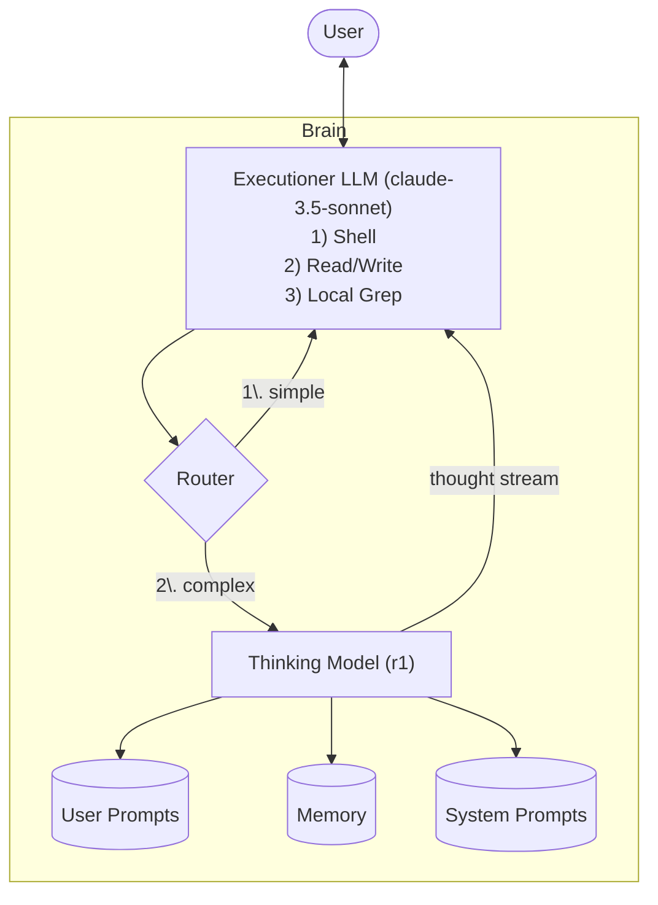

# AI Kit - Supercharge Your AI IDE ⚡️

AI Kit is the first CLI thats not designed for you. Its designed for your agent.

Designed to integrate with a text editor like Cursor or Windsurf (or any environment with a shell), it extends your agent with search, reasoning, and memory. The goal: make myself obsolete. So I can go do other, better, stuff - like scrolling TikTok.

## Only one command for you
This creates an `.ai-kit` directory that both you and your agent have control over.

`init`
Initialize or reset AI Kit in your project.
```bash
ai-kit init
```

## Princples
- Local first, for full control
- Hardcode as little as possible, instead use composable patterns and leverage agency
- At the current state of LLMs, is best not to have a non-reasoning model (like Claude-3.5-sonnet) to plan or make decisions. These models can operate effecitvely wihtin hardcded workflows, for example:

1. If the user says "what is the weather in SF?" use the `weather` tool to get the weather in SF.
2. If the user says "what is 3+3?" use the `math` tool to get the answer.

The problem arises when we have a complex task that requires **planning** and **orchestration** that cant be hardcoded into a set of heuristics like the above. In this case, we want to *avoid* extending the execution agent with many tools and instructions. Instead, we will build a composable system that mirrors the human workflow.

- Runtime first, prefill as little as possible.

**Consider the following:**
The user askes the `Executioner LLM` to write code with the [Anthropic]() Python SDK. Since:
 1. the `Executioner LLM`'s training date is outdated (as with all LLMs), 
 2. The Anthropic Python SDK is changing often

Thus, the model will hallucinate and write outdated code. that doesnt work. The typical way to solve this is to provide the relevant information in context.

Since we have a robust crawler and vector store, principles of [Retrival Augmented Generation]() would recommend:
1. Use the crawler to crawl lots of relevant docs
2. Store them all in the vector store
3. Use a search funciton to retrieve the most relevant docs

There are a few problems with this approach:
1. We need to put the docs to the vector store before our query. Or, we can have the model use a tool to crawl what it needs. This adds some complexity.
2. We need to crawl the entire docs, so that all the infromation is aviable. This is clearly prolematic.

Is this how humans would do it? Definitly not. If I'm using a new package I will:
1. Search for the docs
2. Poke around for the page i want
3. Use that information only 
4. Note to refere back to it later if i need to

With [AI Agents](https://www.anthropic.com/research/building-effective-agents), instead of using traditional RAG patterns, we can use an Agent to go get what we need at runtime, just like a human would.

This is the advantage of agents - we don't have to prefill data and setup heuristics, instead we use an Augmented LLM with a task description but without a specific workflow.

## Setting up your system prompt
The AI has different commands that it can run. The core workflow is as follows

## The System 


An example system prompt (`.cursorrules`) is as follows:
```md
# <-- mode: markdown -->
IF THE USER SAYS "BYPASS INIT" YOU MUST IMMEDIATELY RESPONT WITHOUT RUNNING THINK

<IMPORTANT>
EVERY TIME the user talks to you except for the `BYPASS INIT` command, you must use `ai-kit think [prompt]` to generate a thought stream.

When the user's request involves files or code, run `ai-kit think "prompt {{ path/to/file_1 }} {{ path/to/file_2 }} ..."` You must use the `{{ path/to/file_1 }}` syntax. Do not just use the file name.
</IMPORTANT>

DO NOT RESPOND TO THE USER WITHOUT RUNNING `ai-kit think "prompt {{ path/to/file_1 }} {{ path/to/file_2 }} ..."`
```

**Notes:**
- We include a "BYPASS INIT" command so that we can prevent the initialization when we'd like. For example, if we are using a non-agent that doesn't have tool access, we would use this command to prevent the initialization.

<Callout>
Be wary of adding too much to the system prompt, which will derade performance. Instead, use `user_prompts` that are passed ot the `Thinking LLM`. If you're having a hard time steering the agent, make sure to pass your ptompt into the conversation *before* giving it a task.
</Callout>

### The `Exection LLM` - our entry point

The `Execution LLM` is the LLM that
1. Talks to the user
2. Excutes things on disk via `read/write`, `shell`, and `grep`

In my case, the executioner is a `claude-3.5-sonnet` model built in to [Cursor](https://www.cursor.com/)'s composer.

The `Executioner LLM` is instructed to run the `ai-kit think "prompt {{ some_file_path }}..."` command, which will call the `Router` and decide what to do next.

### The `Router` - not every tasks needs deep though
The router `ai_kit.core.router` is used to route the user's request to the appropriate route.

There are currently two routes:
- `simple`: a simple route that immediately returns to the `Executioner`. For simple tasks that don't require thinking.
- `complex`: a complex route that uses the thinking model to think about the user's request.

The router has 3 input sources:
- `user_prompts`: the user's prompt
- `system_prompts`: the system prompt
- `memory`: the memory

### The `Thinking LLM` - injecting the thought stream
The `Thinking LLM` is the LLM that is used to think about the user's request. In this case, we're using [Deepseek's R1](https://github.com/deepseek-ai/DeepSeek-R1), which always outputs a thought stream *before* responding to the user. We take only the thought stream and pass it back to the `Executioner LLM`. This is a significant performance increase over the `Executioner LLM` alone. It also gives us more control over the overflow workflow, since we can "steer" this LLM with 

Note: The trick here is, when streaming the thought stream into `stdout` for the `Executioner LLM`, we essentially prefil the context window with the thought stream. The `Executioner LLM` will think that it had generated the thought stream, and adjust its response accordingly.

## Development Principles
- dont integration test somethign you can test manually, waste of time
- unit tests as much as possible