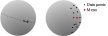
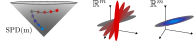

---
jupytext:
  text_representation:
    extension: .md
    format_name: myst
    format_version: 0.13
    jupytext_version: 1.16.2
kernelspec:
  display_name: python3
  language: python
  name: python3
---

# Geometry of SQFA

In this tutorial we provide a brief overview of the geometric perspective
of SQFA and smSQFA. We start by explaining what is supervised linear
dimensionality reduction. Then, we explain how SQFA and smSQFA
use a geometric perspective on discriminability to learn
discriminative linear features.

## SQFA and smSQFA perform supervised dimensionality reduction

Supervised linear dimensionality reduction is a class
of methods that use the class labels of the data to learn a set
of linear features that are useful for classification.

More specifically, given a dataset $\{\mathbf{x}_t, y_t\}_{t=1}^N$
where $\mathbf{x}_t \in \mathbb{R}^n$ are the data vectors,
$y_t \in \{1, \ldots, c}$ are the class labels,
the goal of supervised linear dimensionality reduction in
general is to learn a set of linear filters
$\mathbf{F} \in \mathbb{R}^{n \times m}$, $m<n$ such that
the transformed data points $\mathbf{z}_t = \mathbf{F}^T \mathbf{x}_t$
support classification as best as possible.

The classical example of supervised dimensionality reduction is
[Linear Discriminant Analysis](https://en.wikipedia.org/wiki/Linear_discriminant_analysis)
(LDA). LDA aims to maximize linear discriminability.
For this, LDA uses the class-conditional means
$\mu_i = \mathbb{E}[\mathbf{z} | y=i]$ and the residual covariance matrix
$\Sigma$, where it is assumed that all classes have the same
covariance matrix. Then, LDA learns a set of linear filters
$\mathbf{F} \in \mathbb{R}^{n \times m}$ that maximizes the spread
between the class means (or their distances)
relative to the covariance of the data in the feature space.
For this goal, LDA quantifies the spread between class means
using the Mahalanobis distance,
which is just the Euclidean distance after transforming
the data to have $\Sigma = \mathbf{I}_m$, where $\mathbf{I}_m$
is the $m \times m$ identity matrix.

The goal of SQFA and smSQFA is similar to LDA. What
characterizes SQFA and smSQFA, however, is that they take
into account the class-specific second-order statistics to make
the classes discriminable. Specifically, SQFA uses both
the class-conditional means $\mu_i$ and the class-conditional
covariance matrices $\Sima_i$ of the features,
and smSQFA uses only the class-conditional
second-moment matrices $\Psi_i = \mathbb{E}[\mathbf{z}\mathbf{z}^T | y=i]$.
Then, SQFA and smSQFA learn the
filters that make the classes as different as possible
considering their second-order statistics. Such
differences in second-order statistics are particularly
useful for quadratic classifiers, such as QDA.

But how can we quantify how different two classes
are with respect to their second-order statistics, in a way
that is useful for classification?
SQFA and smSQFA take a geometric perspective to answer this question.
To explain this, we first take a detour into the geometry of
symmetric positive definite (SPD) matrices, and then use this
geometry to explain smSQFA, which is the simpler of the two methods.

## The geometric perspective of smSQFA

:::{admonition} Riemannian manifolds
Riemannian manifolds are geometric spaces that locally look like Euclidean
spaces, but globally can have a more complex structure. The classical example
of a Riemannian manifold is the surface of a sphere. Locally, if we zoom in
enough the sphere looks like an Euclidean plane, but globally it is not an
Euclidean plane, as illustrated by the fact that we can follow a
"straight trajectory" and come back to the same point.

Riemannian geometry provides the tools to do usual geometric operations in
such spaces, like measuring distances, interpolating, finding averages, etc.

<figure>

  
  <figcaption>
  <b>Riemannian manifolds.</b>
  <i>The surface of the sphere is a non-Euclidean space, if we follow
  a "straight" trajectory we end up at the same spot. Riemannian geometry
  allows us to find quantities such as the average of a set of data points
  in a manifold.</i>
  </figcaption>

</figure>
:::

Symmetric Positive Definite (SPD) matrices are symmetric matrices whose
eigenvalues are all strictly positive. This type of matrix appears in many
statistics and machine learning applications. For example, covariance matrices
and second-moment matrices are SPD matrices[^1].
The set of $m$-by$m$ SPD matrices forms a manifold, denoted $\mathrm{SPD(m)}$.
The geometry of $\mathrm{SPD(m)}$ (which is shaped like an open cone
in the space of symmetric matrices) is very well studied, and there
are different formulas for computing distances, geodesics, means, and other
geometric quantities in this space.

As mentioned above, smSQFA focuses on maximizing the
discriminability allowed by the class-conditional
second-moment matrices $\Psi_i$. For this, smSQFA considers the
second-moment matrices $\Psi_i$ as points in the SPD manifold $\mathrm{SPD(m)}$.

<figure>

  
  <figcaption>
  <b>Geometry of data statistics.</b>
  <i>smSQFA considers the geometry of the second-order statistics of
  the data features as points in the SPD manifold. The locations of the
  points in the SPD manifold depends on the filters that are applied to
  the dataset. We use Riemannian geometry to measure the
  distances between the statistics.</i>
  </figcaption>

</figure>

What is the advantage of considering the second-moment matrices
as points in $\mathrm{SPD(m)}$? The key idea is that when matrices
$\Psi_i$ and $\Psi_j$ are farther apart in $\mathrm{SPD(m)}$, they
are more different, and thus more discriminable. Therefore,
smSQFA maximizes the distances between the second-moment matrices
in $\mathrm{SPD(m)}$. This is analogous to how LDA
maximizes the distances between the class means in Euclidean
space[^2]. The objective of smSQFA can be written as

$U\left(\left\{\Psi_i\right\}_{i=1}^{i=q}\right) = \sum_{i=1}^{c}\sum_{j=1}^{c} d(\Psi_i,\Psi_j),$

where $d(\Psi_i,\Psi_j)$ is the Riemannian distance between
the second-moment matrices $\Psi_i$ and $\Psi_j$, and
$c$ is the number of classes. More specifically, out of the
many distances that can be defined in $\mathrm{SPD(m)}$, smSQFA uses
the affine-invariant Riemannian distance, which is related
to quadratic discriminability. The affine invariance distance
is given by

$d(\Psi_i,\Psi_j) = \left\| \log(\Psi_i^{-1/2}\Psi_j\Psi_i^{-1/2}) \right\|_F =
\sum_{k=1}^{m} \log^2(\lambda_k),$

where $\log$ is the matrix logarithm, $\|\cdot\|_F$ is the Frobenius norm,
and where $\lambda_k$ are the eigenvalues of $\Psi_i^{-1/2}\Psi_j\Psi_i^{-1/2}$,
or equivalently, the generalized eigenvalues of the
pair $(\Psi_i, \Psi_j)$.

The relationship between the
affine-invariant distance and quadratic discriminability is
discussed at length in the [SQFA paper](https://arxiv.org/abs/2502.00168).
With this geometric approach, smSQFA learns filters that
allow for quadratic discriminability, as shown with different
examples in the documentation tutorials.

<figure>

  
  <figcaption>
  <b>Manifold distance and discriminability.</b>
  <i>The idea behind smSQFA is that the larger the Riemannian distance
  between the second moment matrices of the classes, 
  the more discriminable these classes are. This is
  illustrated in the cartoon, which shows a second-moment matrix as a
  point in SPD(m) (grey star), and two trajectories in the manifold
  getting away from this baseline (red and blue stars). To the right, the
  ellipses corresponding to each second-moment matrix are shown. 
  As the stars get farther from the baseline in SPD(m),
  the ellipses become more different. In the red trajectory distributions
  become more different by rotating, and in the blue trajectory
  by shrinking.</i>
  </figcaption>

</figure>

:::{admonition} SQFA input types: Raw data vs statistics
Note that in order to compute the class-conditional means,
covariances, and second-moment matrices of the features, we
only need these statistics for the raw data $\mathbf{x}_t$.
For example, the second-moment matrix $\Psi_i$ can be computed
as $\Psi_i = F^T \mathbb{E}[\mathbf{x}\mathbf{x}^T |y=i] F$.
Thus, SQFA only needs the class-conditional statistics of the raw data
for learning the filters. The `sqfa` package models can
take either the raw data or the data statistics as input.
:::

## Using first- and second-order statistics

We have presented the example of smSQFA, which maximizes the
discriminability based on the second-moment matrices of the
features. However, second-moment matrices are less informative
than considering both the means and the covariance matrices
of the features simultaneously. SQFA considers both the
class-conditional means and covariances.

SQFA uses the same geometric perspective as smSQFA, but
using a different manifold that accounts for both means and
covariances. This is the information-geometry manifold of
$m$-dimensional Gaussian distributions, denoted
$\mathcal{M}_{\mathcal{N}}$, where each point
corresponds to a Gaussian distribution $\mathcal{N}(\mu, \Sigma)$.
SQFA uses the Fisher-Rao distance to measure the distances
between the classes.
Like in the previous case, SQFA computes the means $\mu_i$ and
covariance matrices $\Sigma_i$ of the features for each class,
and then it computes the Fisher-Rao distance between the
Gaussian distributions $\mathcal{N}(\mu_i, \Sigma_i)$ and
$\mathcal{N}(\mu_j, \Sigma_j)$. SQFA finds the linear
filters $\mathbf{F}$ that maximize the sum of the
pairwise Fisher-Rao distances between the classes. The
link between the Fisher-Rao distance and quadratic discriminability
is discussed in the [SQFA paper](https://arxiv.org/abs/2502.00168).

:::{admonition} LDA is a special case of SQFA
In the SQFA paper we show that LDA is a special case of
SQFA when all the classes have the same covariance matrix.
That is, when all the classes have the same covariance
matrix, LDA maximizes the sum of pairwise Fisher-Rao distances
between the classes.
:::

One important final detail to note is that, unlike the
affine-invariant distance, there is no closed-form
expression for the Fisher-Rao distance between two Gaussians.
Thus, SQFA uses an approximation. This approximation,
sometimes called the
[Calvo-Oller](https://www.sciencedirect.com/science/article/pii/0047259X9090026E)
approximation, is a lower bound obtained by embedding
the means and covariances into the $\mathrm{SPD(m+1)}$ manifold, and
then computing the affine-invariant distance between
the embeddings. More detail is given in the SQFA paper.

In summary, SQFA and smSQFA leverage information geometry
to learn discriminative features by that maximizing the distances
between the class statistics. In the next tutorials we will learn
how to use the `sqfa` package, and how the features learned by
SQFA and smSQFA compare to other methods.

[^1]: Covariance and second-moment matrices can sometimes be
rank deficient, or singular. These matrices are called
"positive semi-definite" (PSD), and they form a different
geometric space. This tutorial focuses on the case where second-moment
matrices are full rank, and thus SPD.
[^2]: In fact, LDA can be seen as a special case of SQFA where
all the classes have the same covariance matrix. This is
developed in the SQFA paper.
